<!-- _class: standout -->

# Brinkmate (Part 1)
### Materials For Advanced Shogi Players

TAKAHASHI, Hideaki

---
<!-- _class: small -->
## Profile

TAKAHASHI, Hideaki (髙橋 英晃)

### Over the Board:
- Won several national amateur titles in 🇯🇵
- Ex-professional 2 dan

### Online Ratings (Maximum):
- 2940 (Shogi Club 24)
- 2769 (Shogi Quest)
- 8 dan (Shogi Wars)

---
## Prerequisite
We use *Modified* [Kitao–Kawasaki notation](https://en.wikipedia.org/wiki/Shogi_notation#Kitao%E2%80%93Kawasaki_notation) (Wikipedia) in this material,

e.g. 
☗歩-76 ☖歩-34 ☗角x22+ ☖銀x ☗角'45.
 

Because the asterisk "*" already has another use in markdown documents, it has been replaced by the apostrophe " ' ".

##
Also, some notations will be employed from chess terminology.

<!-- 演習では動画の一時停止を推奨する -->

---
<!-- _class: standout -->
# What is Brinkmate?

---
## Definition
(Quote from [Tomohide Kawasaki, *Japanese-English Shogi Dictionary*, Nekomado, 2013](https://store.shopping.yahoo.co.jp/nekomadoshop/h047.html))

### ひっし 【必至/必死】 *n. Brinkmate.*
A threatmate, in which there is no way for the king's side to avoid the forced mate in the next move.

### ひっしもんだい 【必至問題】 *n. Brinkmate problem.*
A type of shogi problem, in which a partial position is presented, and one must find a solution to force brinkmate to the king with consecutive checks or threatmates.

<!-- brinkmate で brinkmate problem を表現することもあるが、この資料では両者を区別する -->

---
<!-- _class: small -->
## Examples
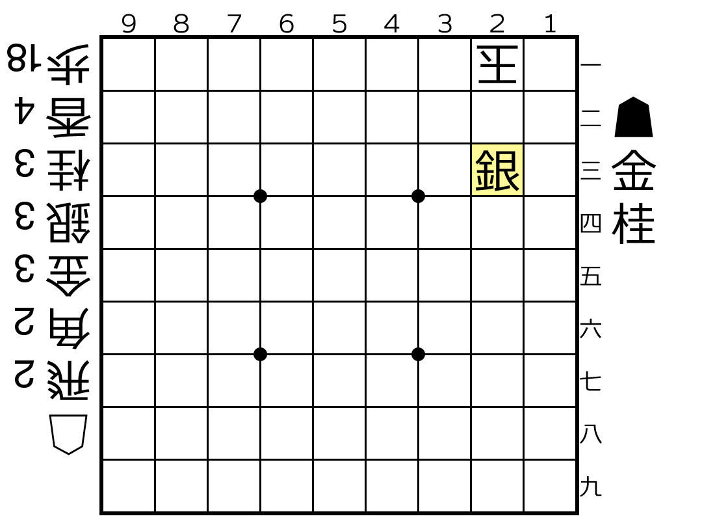

It is not always obvious whether a position is brinkmate or not
because there are usually many possible ways of resistance.

### Exercise 1
Confirm that this position is brinkmate. In particular, find the mates to the following replies.

- ☖金'22
- ☖飛'92
- ☖飛'42
- ☖角'77

---
<!-- _class: small -->
## Solution to Exer. 1

### ☖金'22...

☗桂'33 ☖玉-11 ☗金'21 ☖金x ☗桂x+ ☖玉x ☗金'22

### ☖飛'92...

☗桂'33 ☖玉-31 ☗金'41

### ☖飛'42...

☗桂'33 ☖玉-31 ☗金'21

### ☖角'77...

☗桂'13 ☖玉-31 ☗金'32

<!-- 動画では説明を省略する -->

---
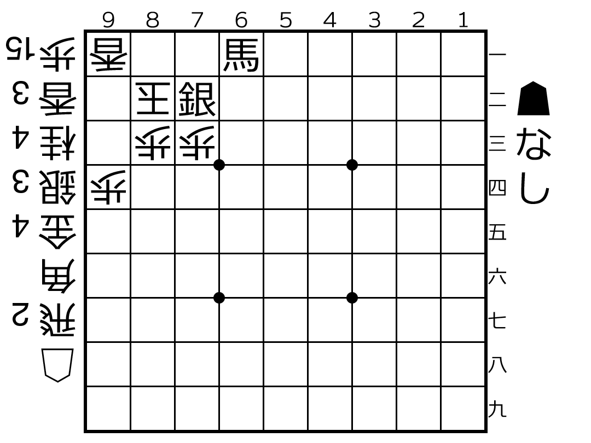
## Examples
Similar to the position known as typical brinkmate
but this is actually **NOT**!

### Exercise 2
Find the opponent's best reply.

### 
(*Hint*: If had 桂 on 81, it would be brinkmate)

---
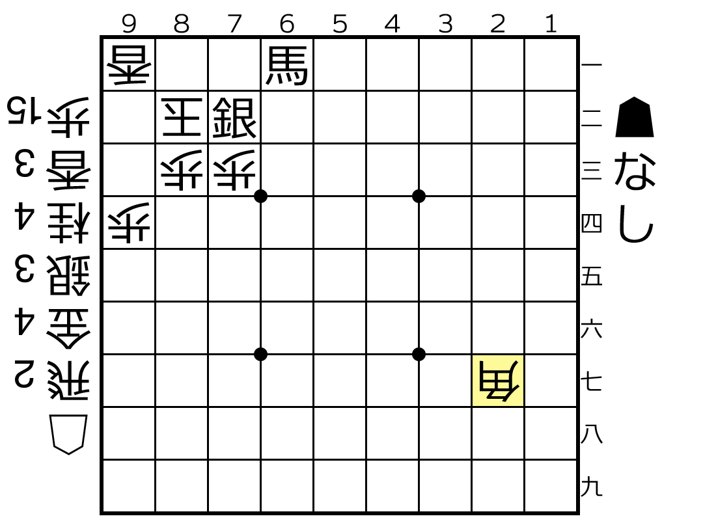

## Solution to Exer. 2

☖角'27!

###
Other drops of 角 on the diagonal are also correct.

Confirm that there is neither immediate checkmate nor line to brinkmate.

---
<!-- _class: standout -->
# How to proceed with this slide

---
## Process
This course proceeds as follows:

1. Confirmation of the fundamental brinkmate position
   - :ballot_box_with_check: done in Exer. 1
2. Analysis of variations of 1.
3. Analysis of more practical cases

## 
For the sake of clarity, we may go back and forth between 2. and 3.

---
## :blue_book: Reference

[Takashi Kaneko, *必死道場*. Mynavi. 2019.](https://book.mynavi.jp/ec/products/detail/id=105424)

In my view, this is the best book that collects brinkmate problems.

In this slide, the exercises on the book and their variations (which I modified on my own) are marked with emoji :blue_book:.

---
<!-- _class: standout -->
# Variations

---
## 香 on the 1st file
### Exercise 3
Determine if each of the following states are brinkmate or not.
If not, analyse if there is a way to force brinkmate.

| 3.1 | 3.2 |
| :-: | :-: |
| 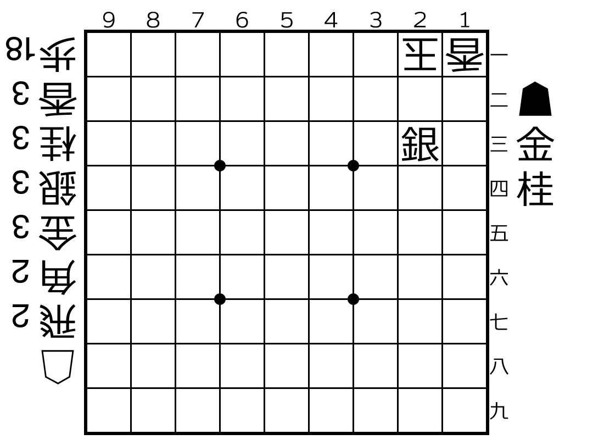 | 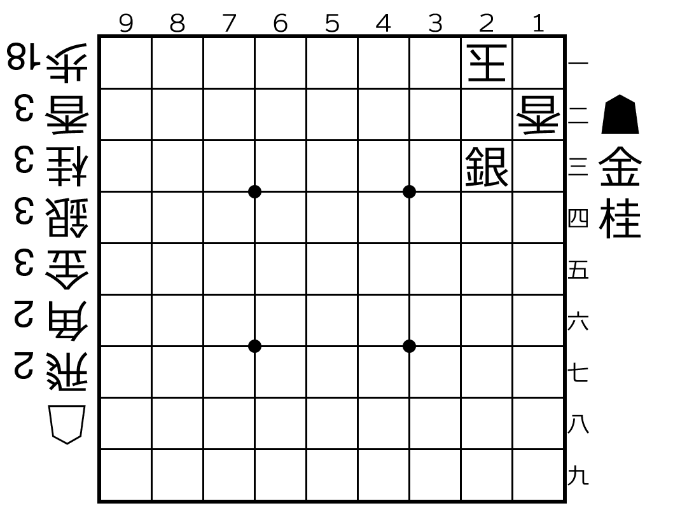 |

---
<!-- _class: small -->
### Solution to Exer. 3.1

Brinkmate.
 

The 香 controls the square 13. But at the same time, it blocks the escape room for the 玉 by itself.

### Solution to Exer. 3.2

☖角'77 (forced) ☗金'32 ☖玉-11 ☗桂'33 ☖角x+ ☗金x.
 

Now reached brinkmate (check it).

---
<!-- _class: small -->
### Solution to Exer. 3.2

Brinkmate in 7 moves.
 

<iframe src="https://play.mogproject.com/?u=7k1_8l_7S1_9_9_9_9_9_9.w.GN2r2b3g3s3n3l18p~0.byub9m04ibnm7j51emc0ybw20022e1050bj014k291.~4.b941dm7j5b92.&embed=true&sz=25&layout=s&p=jp1&bi=ja&ve=true&se=false" width="281" height="499"></iframe>

---
<!-- _class: small -->
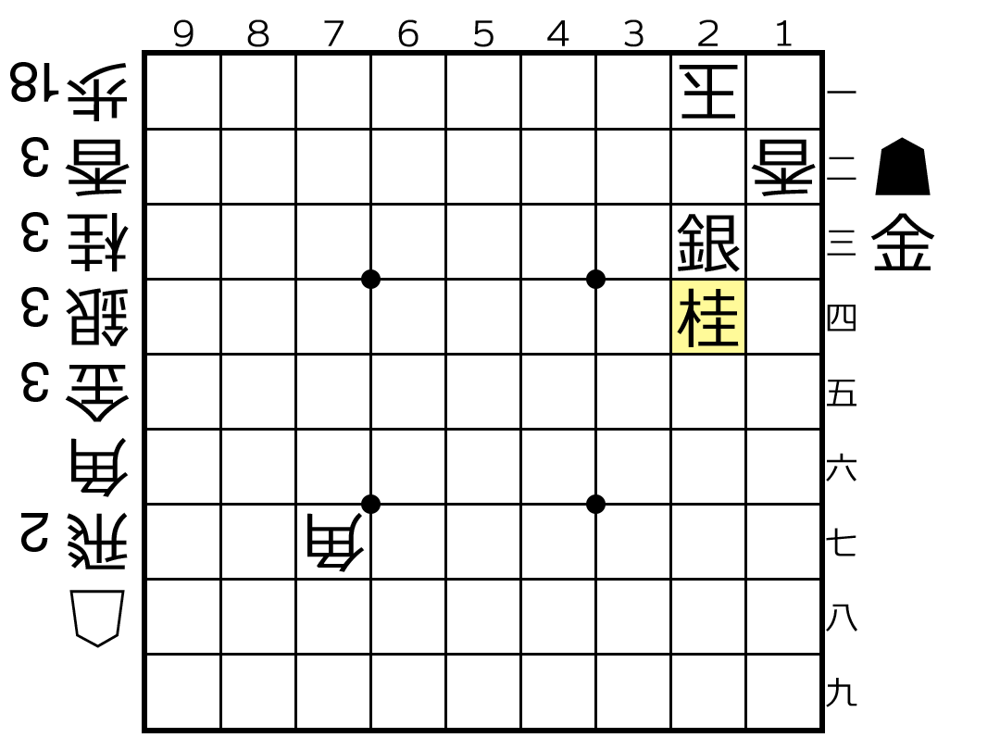

### (Analysis of alternative ☗桂'24)

---
<!-- _class: small -->
## Promoted pieces
### Exercise 4
Determine if each of the following states are brinkmate or not.
If not, analyse if there is a way to force brinkmate.

| 4.1 | 4.2 | 4.3 :blue_book: |
| :-: | :-: | :-: |
| 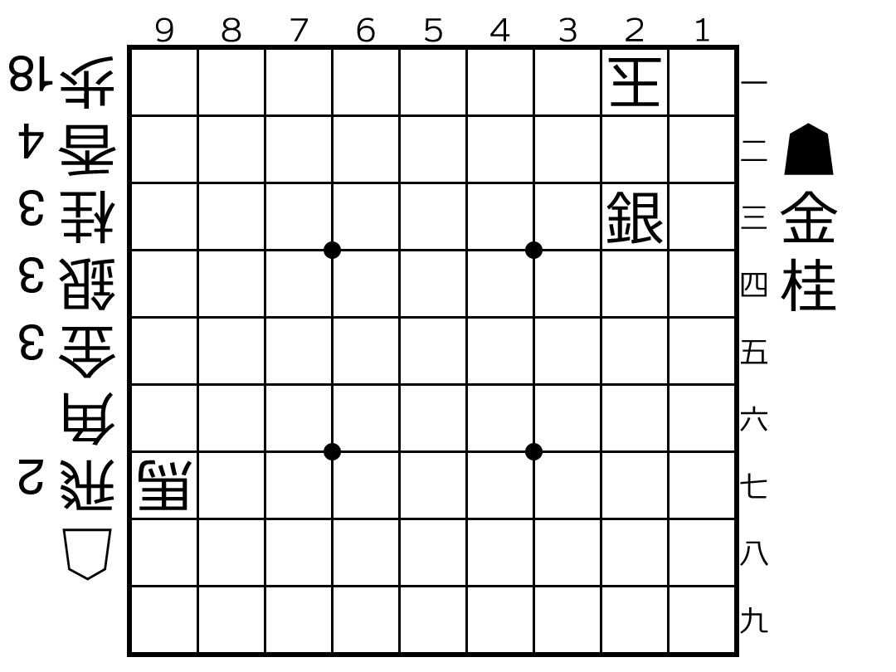 | 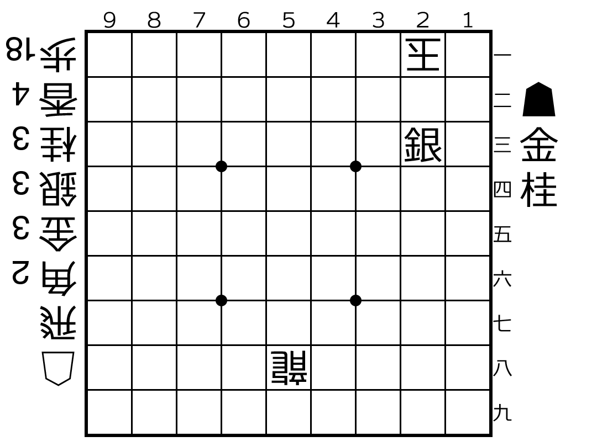 | 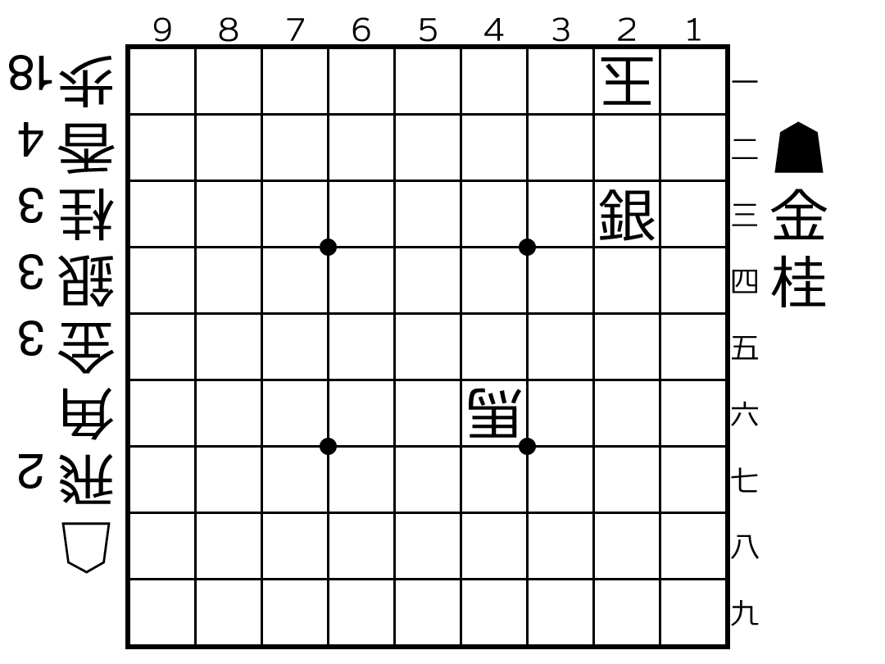 |

---
<!-- _class: small -->
### Solution to Exer. 4.1

Brinkmate.

### Solution to Exer. 4.2

No brinkmating continuation after ☖龍-52!

### Solution to Exer. 4.3
It has in common with Exer. 3.2 in that the square 13 is controlled by the opponent.
Thus, the introduction echoes.

☖角'77 ☗金'32 ☖玉-11 ☗桂'33 ☖角x+ ☗金x ☖飛'92 
 

Now the difference appears from Exer. 3.2: no immediate mate here.

☗角'44!
 

Brinkmate! Just in case, an example continuation to mate is shown below.

☖銀'31 ☗金-32 ☖歩'22 ☗銀x22+ ☖銀x22 ☗角x22+#
 

---
<!-- _class: small -->
### Solution to Exer. 4.3

Brinkmate in 9 moves.
 

<iframe src="https://play.mogproject.com/?u=7k1_9_7S1_9_9_5zb3_9_9_9.w.GN2rb3g3s3n4l18p~0.byub9m04ibnm7j51emc0ybx6br42imbe22e309k3rl.&embed=true&sz=25&layout=s&p=jp1&bi=ja&ve=true&se=false" width="281" height="499"></iframe>

<!-- note that もし馬が35にあったら必死をかける順はない -->

---
<!-- _class: standout -->
# More practical positions

---
## From my own game
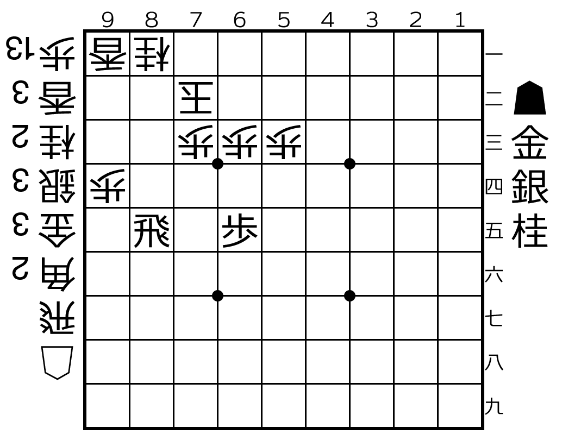

This situation occurred in my own game. At that time I had only 30 seconds. :alarm_clock:

### Exercise 5
Find the line to brinkmate.

---
## From my own game
### Solution to Exer. 5

☗桂'74! ☖歩x ☗飛x81+! ☖玉x ☗銀'83.
 

### (Note)
I initially thought of ☗桂'75, but it was not threatmate.

If ☖歩 on 94 were on 93, ☗桂'75 would be followed by ☗飛-82+...#

---
## From the book :blue_book:
### Exercise 6 :blue_book:

| 6.1 | 6.2 | 6.3 |
| :-: | :-: | :-: |
| 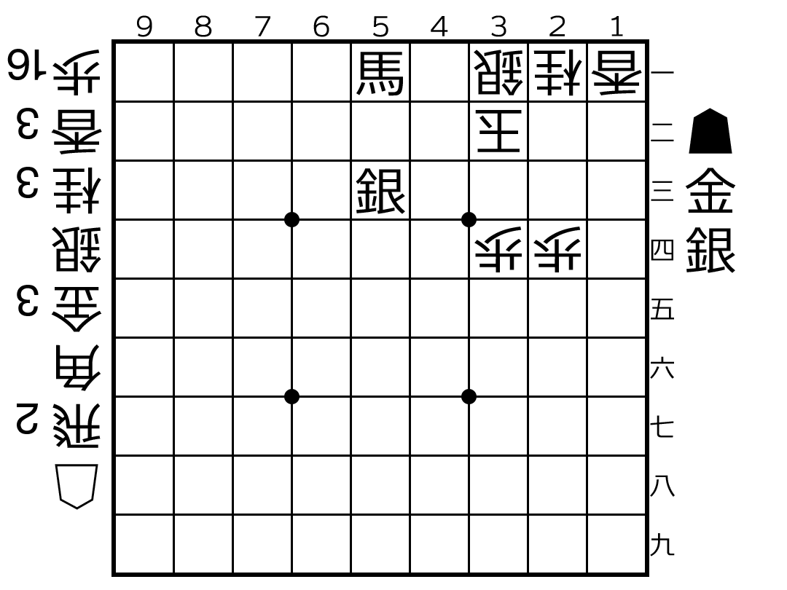 | 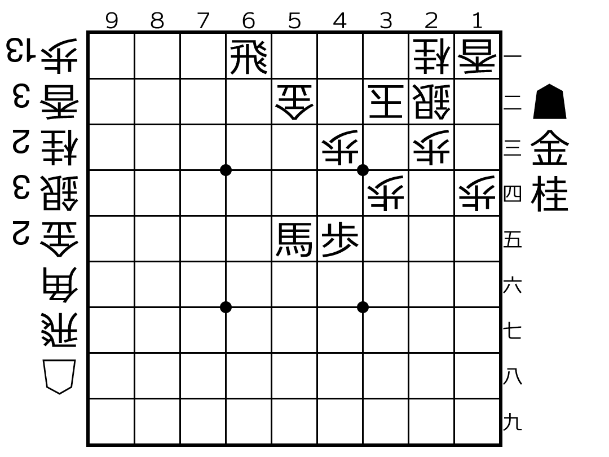 | 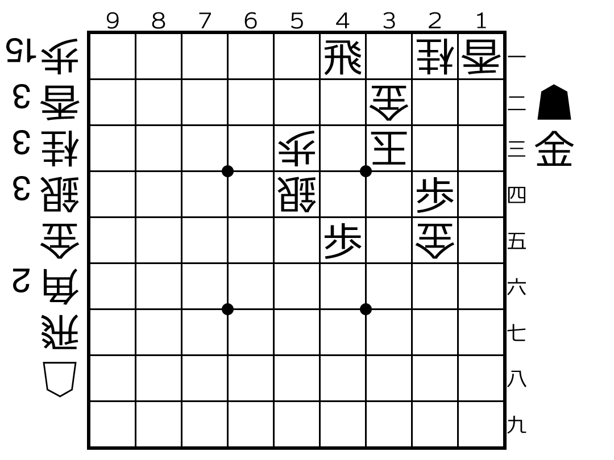 |

---
## From the book :blue_book:
### Solution to Exer. 6.1

☗馬-41! ☖玉x ☗銀'43.
 

### Solution to Exer. 6.2

☗桂'24! ☖歩x ☗馬x22! ☖玉x ☗飛x21+ ☖玉x ☗銀'23.
 

### Solution to Exer. 6.3

☗金'34! ☖玉-22 ☗歩-23+ ☖金x ☗飛x21+ ☖玉x ☗金x23.

---
<!-- _class: small -->
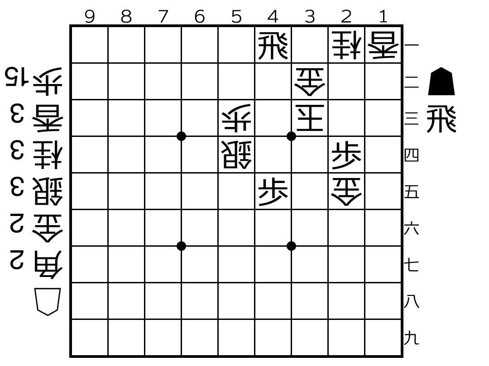

## A variation of Exer. 6.3
As for Exer. 6.3, I tried to replace 金 in hand with 飛 and found it interesting position.

Creating variations on your own and analysing can help deepen your understanding of fundamental positions.

### Exercise 7 :blue_book:
Analyse if there is a maneuver to force brinkmate.

---
<!-- _class: small -->
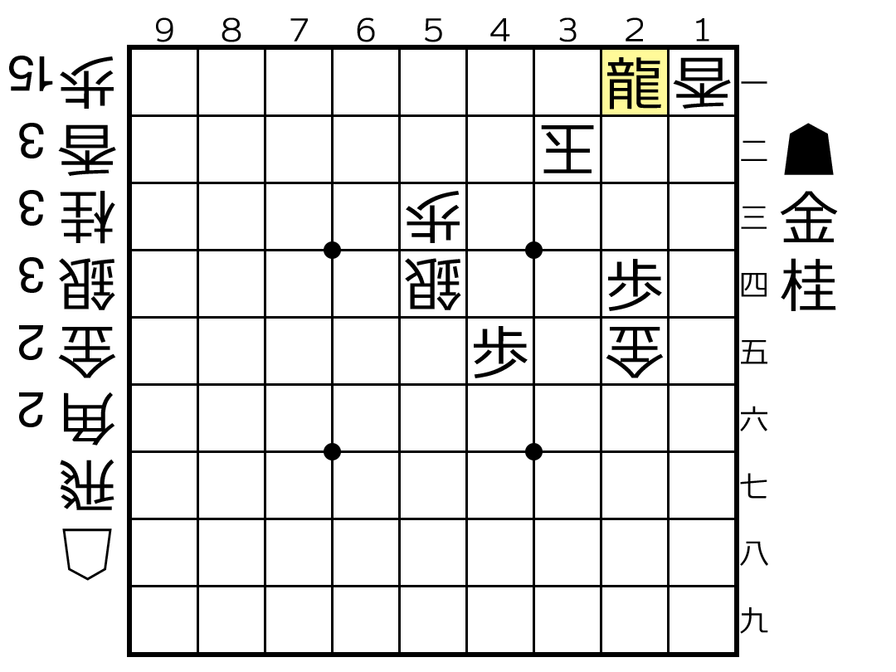
### Solution to Exer. 7

No other way at the beginning:

☗飛'34 ☖玉-22 ☗飛x32+ ☖玉x ☗飛x21+

 

Since the sacrifice cannot be accepted, the following 3 options remain.

1. ☖玉-42
2. ☖玉-43
3. ☖玉-33

#
Which move should the opponent choose?

---
<!-- _class: small -->
### Solution to Exer. 7
#### 2. ☖玉-43?
It leads to the immediate mate:

☗龍-41 ☖玉-33 ☗金'23 ☖玉-34 ☗龍-44#
 

#### 3. ☖玉-33!
The 玉 is trying to flight from the route 34-35.
Many possible continuations are considered, for example,

☗龍-23 ☖玉-42 ☗桂'44 ☖金'33! ☗龍-22 ☖玉-43 ☗歩-23+ ☖銀x45 ☗とx33 ☖玉-54...

or

☗金'44 ☖玉-42 ☗龍-61 ☖金'51! ☗桂'34 ☖玉-41 ☗金x53 ☖玉-32 ☗龍x51 ☖玉-33...
 

But none of them seem to work eventually.

---
<!-- _class: small -->
### Solution to Exer. 7
#### 1. ☖玉-42!

#
Now we reached the conclusion that there was no way to force brinkmate.

---
<!-- _class: small -->
## More practically
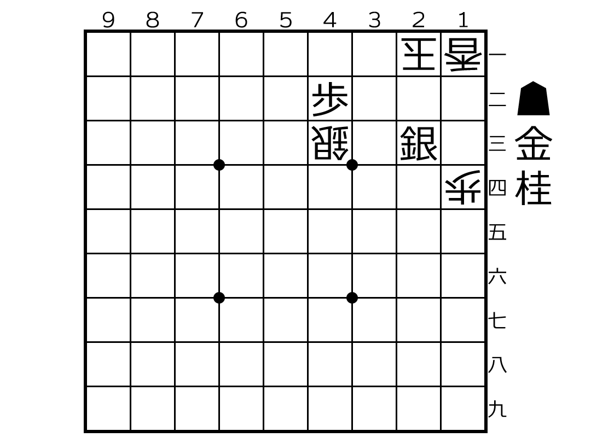

Although it is imposed in problem that every other pieces are in opponent's hand, brinkmate is more likely to occur in a real game due to the possibility of the lack of pieces in hand.

For example, this 玉 will survive if there is 銀 or 角 in hand, but otherwise it is brinkmate.

It is necessary to think flexibly in a real game.

---
<!-- _class: standout -->
# Summary

(under construction)

