<!-- _class: standout -->

# Brinkmate Part 1
### Materials for Advanced Shogi Players
TAKAHASHI, Hideaki (髙橋 英晃)

<!--
Hello. こんにちは．I'm Hide.
This channel is established and designed for international shogi players at an advanced level.
The title of this first video is Brinkmate Part 1.
 -->

---
<!-- _class: small -->
## Profile
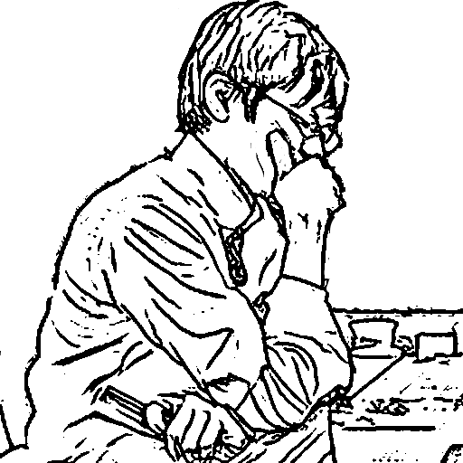

### TAKAHASHI, Hideaki (髙橋 英晃)

### Over the Board:
- Won several national amateur titles in 🇯🇵
- Won the world open several times
- Ex-professional 2 dan

### Online Ratings (Maximum):
- 2940 (Shogi Club 24)
- 2769 (Shogi Quest)
- 8 dan (Shogi Wars)

<!--
As this is the first video on this channel, let me briefly introduce myself.
My full name is Hideaki Takahashi.
I have won several national amateur titles in Japan and other accomplishments as well.
-->

---
## Prerequisite
[Kitao–Kawasaki notation](https://en.wikipedia.org/wiki/Shogi_notation#Kitao%E2%80%93Kawasaki_notation) (Wikipedia) is used in this slide, e.g.

☗歩-76 ☖歩-34 ☗角x22+ ☖銀x ☗角'45.
 

(Since the asterisk "*" already serves another purpose in Markdown, they are replaced with apostrophes " ' ")

##
Also, some expressions will be employed from chess terminology.

<!--
And let me mention the notation that I plan to use today.
I'll use the modified Kitao–Kawasaki notation. The example line described here is read out for example ... and so on.
Maybe you are not so familiar with this notation. It is closer to the notation used in Japan, but I find it less ambiguous and with higher readability than the Japanese style.
In addition, I will employ some convenient expressions from chess terminology.
 -->

---
<!-- _class: standout -->
# What is Brinkmate?

<!-- Now let's get to the today's main section.
First of all, what is brinkmate? -->

---
## Definition
> [Tomohide Kawasaki, *Japanese-English Shogi Dictionary*, Nekomado, 2013](https://store.shopping.yahoo.co.jp/nekomadoshop/h047.html)

### ひっし 【必至/必死】 *n. Brinkmate.*
A threatmate, in which there is no way for the king's side to avoid the forced mate in the next move.

### ひっしもんだい 【必至問題】 *n. Brinkmate problem.*
A type of shogi problem, in which a partial position is presented, and one must find a solution to force brinkmate to the king with consecutive checks or <u>threatmates</u>.

<!-- If we were to attempt to describe brinkmate in words, it might be thus. 
...
Or this might be clearer: In a game, if you put the opponent's king in brinkmate and there are no immediate means to checkmate your king afterward, your victory is guaranteed.
We will explore specific brinkmate positions starting from the next page.

But before moving on, one more thing. "Brinkmate problem." This is considered as the brinkmate version of 詰将棋. However, please note the sequences for brinkmate problems include not only checks but also threatmates.
Later on, we will solve many brinkmate problems. Some of them will be challenging even for professional players.

Now let's move on to the first step.
-->

---
<!-- _class: small -->
## The Basic Position

Determining whether a position is brinkmate is not always straightforward.

## Exercise 1
Check the position is brinkmate.
In particular, find checkmating lines for each of the following replies.

- ☖金'22
- ☖飛'92
- ☖飛'42
- ☖角'77

<!-- 
The position shown here is brinkmate, and this is the list of possible replies by White. Calculate checkmating lines after each move.
I will now count to three. Please pause the video during this time, calculate until you come to your own conclusion, and then proceed. The same approach will be followed for the subsequent exercises. OK?
3, 2... Now let's look at the answer. 
-->

---
## The Basic Position
### Solution to Exercise 1
<!-- 
_class: small
-->

#### ☖金'22...

☗桂'33 ☖玉-11 ☗金'21 ☖金x ☗桂x+ ☖玉x ☗金'22#

#### ☖飛'92...

☗桂'33 ☖玉-31 ☗金'41#

#### ☖飛'42...

☗桂'33 ☖玉-31 ☗金'21#

#### ☖角'77...

☗桂'13 ☖玉-31 ☗金'32#

<!--
Here is the solution. I demonstrate only the line after ☖金'22 on the board and skip the rest.
...
-->

---

## Counterexample
It resembles a basic brinkmate, but this is **NOT** brinkmate!

## Exercise 2
White to move.

<!-- 
OK. One more exercise.
This position is NOT brinkmate. Not brinkmate, which means there is a way for White's king out from mating net. Please find how.
As before, please pause the video and calculate. 3, 2.. OK.
 -->

---

## Counterexample
### Solution to Exercise 2

☖角'27!
 

Other 角 drops on the diagonal are also correct.

###
Confirm that there is no brinkmating line for Black from this position.

<!-- 
B'27 is the move. Either B'18 or B'54, for example, is also correct.

Through these exercises, I hope you understand that determining whether a position is brinkmate is not necessarily straightforward. OK?
 -->

---
<!-- _class: standout -->
# How to Proceed

<!-- Now I would like to mention how this course will proceed. -->
---
## Process
This course proceeds as follows:

1. Confirming that a basic brinkmate position is indeed brinkmate,
   - :ballot_box_with_check: done in Exercise 1
2. Analyzing variations of the basic position,
3. Analyzing more practical positions.

<!-- 
This video consists of 3 steps, excluding the introduction.
In Step 1, I show a basic brinkmate position and let you confirm that the position is actually brinkmate. Today we have already done this step in Exercise 1.
In Step 2, we will see some variations of the basic position and will consider whether or not we can lead to brinkmate from each of them.
In Step 3, we will analyze more practical cases which will occur in actual games.
 -->

---
## :blue_book: Reference

> [Takashi Kaneko, **必死道場**. Mynavi. 2019.](https://book.mynavi.jp/ec/products/detail/id=105424)

In my view, this is the most useful book that collects brinkmate problems for practice.

The problems in the book and their variations (which I modified for my purposes) are marked with emoji ':blue_book:' in this slide.
<!-- 
BTW, I would like to introduce a book here.
There are only a few brinkmate problem books even in Japan, but this book titled as "必死道場" is, in my view, the best book among them.
In step 2 and step 3, I will quote some of the brinkmate problems included in this book, either verbatim or in my modified form. Just in case, I contacted the author for permission regarding the quotes, and obtained consent.
The quoted problems will be marked with this blue_book emoji.

 -->

---
<!-- _class: standout -->
# Variations

<!-- 
Now let's move on to Step 2.
 -->
---
<!-- _class: small -->
## Exercise 3
White to move.
Analyze whether or not each of the following positions is brinkmate.
If not, calculate whether Black can lead to brinkmate within several moves.

| 3.1 | 3.2 |
| :-------------------------------------------------: | :-------------------------------------------------: |
|                      |                      |

<!-- 
In these positions, a lance is placed on the 1st file preventing ☗桂'13.
Please pause the video again to calculate whether or not each position is brinkmate. And if you determine that it is not brinkmate, which means White has a reply to avoid immediate checkmate, consider whether Black can achieve brinkmate within a few moves.
OK? 3, 2.. now move on to the answer.
 -->

---
<!-- _class: small -->

## Exercise 3
### Solution to Exercise 3.1

Brinkmate.
 

<!-- 
The position of Exercise 3.1 is brinkmate. 
As I mentioned ☗桂'13 check is blocked, but for example ☖角'77 doesn't prevent another checkmate ☗金'32#. And as for the other lines, the lance works nothing.
 -->

---
<!-- _class: small -->
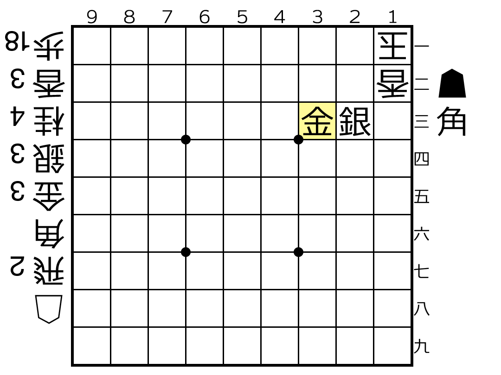
## Exercise 3
### Solution to Exercise 3.2

☖角'77 (forced) ☗金'32 ☖玉-11 ☗桂'33 ☖角x+ ☗金x (brinkmate),
 

e.g.
...☖飛'92 ☗角'22 ☖玉-21 ☗銀x12+ ☖玉x ☗香'13 ☖玉-21 ☗香-11+#.

<!-- 
In Exercise 3.2, following ☖角'77 ☗金'32, White's king can escape to the corner.
Black continues to attack by ☗桂'33. Then White has to cover the squares 21 and 22 simultaneously. The sacrifice ☖金'31 doesn't work due to ☗金x ☖角x33+ ☗金'21#. So here ☖角x+ is forced. Black takes back.

Actually, this position is brinkmate, but have you considered ☖飛'92 and how to checkmate from here? If haven't, please pause the video again and calculate... OK? ☗角'22 ☖玉-21 ☗銀x12+ ☖玉x ☗香'13 ☖玉-21 ☗香-11+#.
In conclusion, Black can brinkmate in 7 moves, starting from ☗銀'23.
 -->

---
<!-- _class: small -->

### Further Note: ☗桂'24
Let's delve into the alternative ☗桂'24.

(☗桂'24) ☖金'22 (forced) ☗金'32 ☖玉-11 ☗金x22 ☖角x+,

###
then Black has 2 possible options:

A. ☗桂-32+
B. ☗金'33

### Exercise (Optional)
Which move is better?
Or does it lead to the same?

<!-- 
Regarding Exercise 3.2, let's consider an alternative ☗桂'24, apart from ☗金'32.
...

You have 2 options here. ... Which move do you think better? Or does it lead to the same?
Just for your information, this optional exercise is quite challenging. If you decide to take on the challenge, the time to pause this video might be longer.
3, 2.. OK? Now, let's see the answer.
 -->

---
<!-- _class: small -->
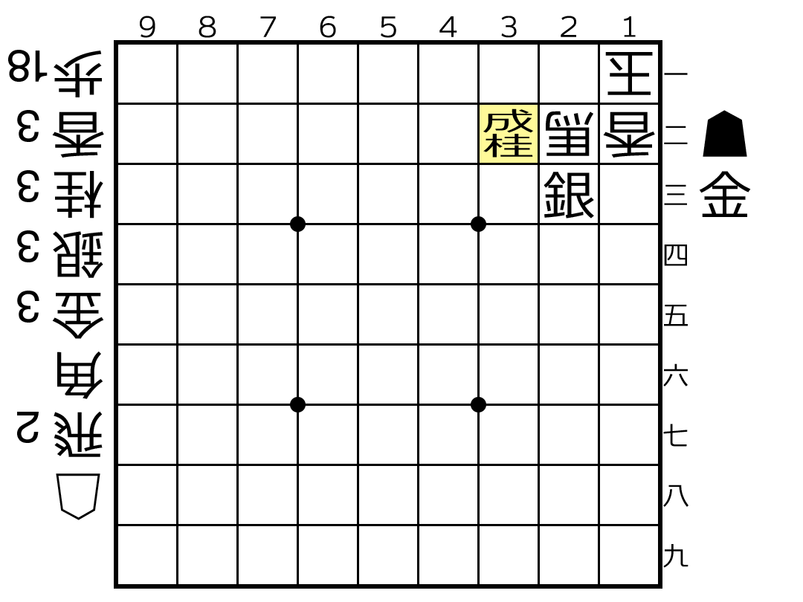
### Further Note: ☗桂'24
#### A. ☗桂-32+?

☖馬x ☗銀x32+ ☖金'21 ☗角'44 ☖歩'22 ☗+銀x ☖金x ☗歩'23 ☖金'21 ☗歩x22+ ☖金x ☗金'32 ☖金'21 ☗金'23 ☖金x32 ☗金x ☖金'21...
 

will reach repetition.

<!-- 
First, we explore N-32+. Due to the length of the sequences, I'll skip detailed explanations for each move and only demonstrate on the board.
...
That results in perpetual.
-->

---
<!-- _class: small -->
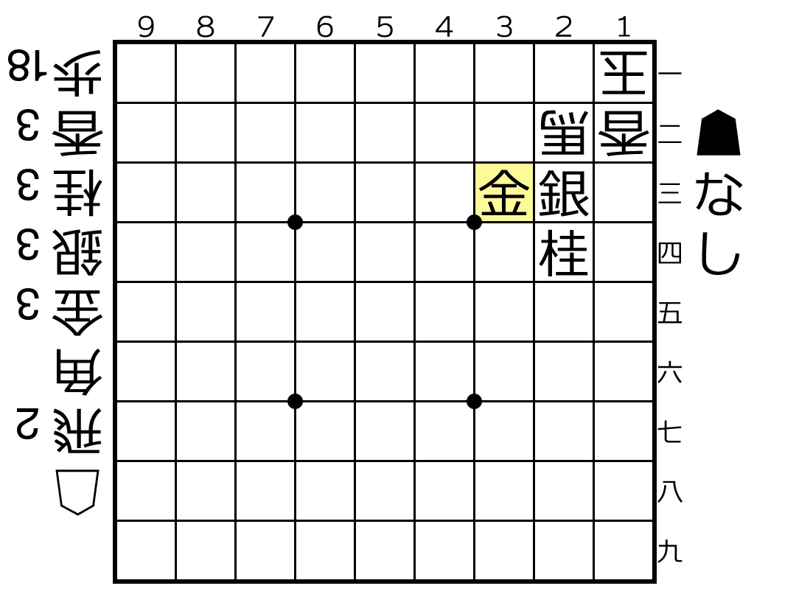
### Further Note: ☗桂'24
#### B. ☗金'33!

☖馬x23 ☗金x ☖金'22 ☗角'44 ☖金'21 ☗桂x12+ ☖金21x ☗香'19 ☖金'21 ☗香x12+ ☖金12x ☗角x22+ ☖金x ☗金'13...
 

Remark that 金 is out of stock!

####

...☖飛'92 ☗金23x22 ☖飛x22 ☗金'13 ☖金'21 ☗金13x22 ☖金x22 ☗飛'31...

<!-- 
Secondly, we check G'33.
...
Now 金 is out of stock in White's hand.
Then ...
 -->

---
<!-- _class: small -->
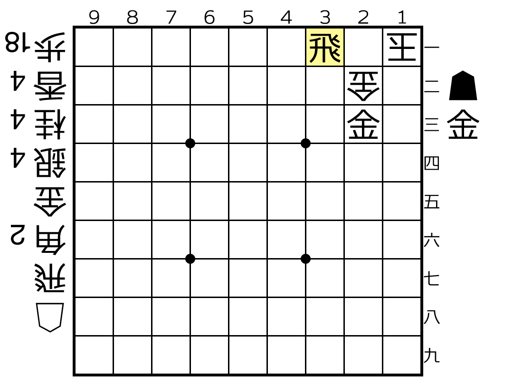
### Further Note: ☗桂'24
#### B. ☗金'33!
With no matter which piece White defends, Black can reach brinkmate,
e.g.
- ☖歩'21 ☗金x22 ☖玉x ☗金'33 ☖玉-13
  ☗飛x21+ (brinkmate)
- ☖桂'21 ☗金'32...
  - ☖金x ☗飛x+ (brinkmate)
  - ☖金'12 ☗金x21...#

<!-- Now White has to put some piece on 21, but with no matter which piece, Black can achieve brinkmate eventually.

As my conclusion, choosing ☗桂'24 will still lead to brinkmate in the end. However, it takes over 30 moves from the initial position, making it less straightforward compared to the main line.
 -->

---
<!-- _class: small -->
## Exercise 4
White to move.
Analyze whether or not each of the following positions is brinkmate.
If not, calculate whether Black can lead to brinkmate within several moves.

| 4.1 | 4.2 | 4.3 :blue_book: |
| :-------------------------------------------------: | :-------------------------------------------------: | :-------------------------------------------------------------: |
|                      |                      |                                  |

<!-- 
Let's consider other variations.
Please pause the video and analyze whether brinkmate can be achieved from each of these positions.
3, 2... now let's reveal the answer.
 -->

---
<!-- _class: small -->
## Exercise 4

### Solution to Exercise 4.1

Brinkmate.

<!-- 
The position of Exercise 4.1 is brinkmate. The ☖馬 on 97 doesn't affect the outcome.
 -->

---
<!-- _class: small -->
## Exercise 4
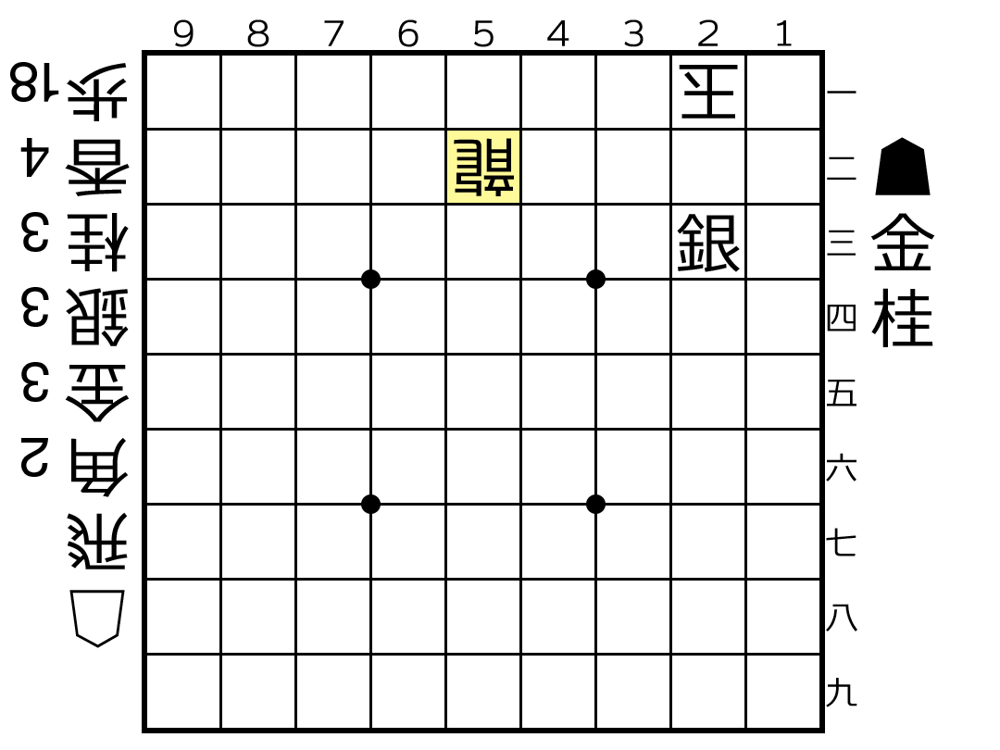
### Solution to Exercise 4.2

☖龍-52! (not brinkmate)

<!-- As for Exercise 4.2, there is no brinkmate after ☖龍-52. -->

---
<!-- _class: small -->
## Exercise 4
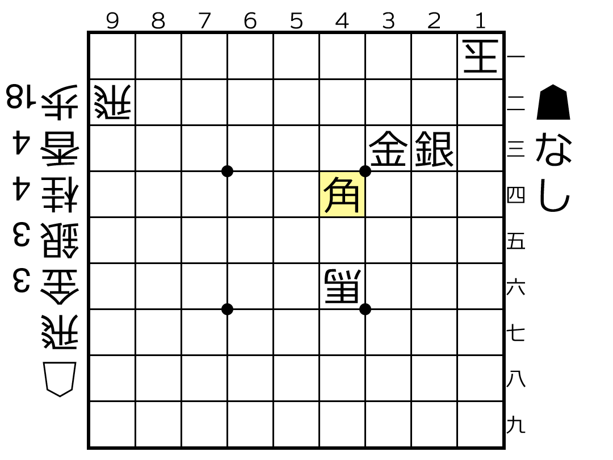
### Solution to Exercise 4.3
In common with Exercise 3.2 in that ☗桂'13 is blocked, the beginning echoes.

☖角'77 ☗金'32 ☖玉-11 ☗桂'33 ☖角x+ ☗金x ☖飛'92... 
 

Now the difference appears from Exercise 3.2.

...☗角'44! (brinkmate)
 
(e.g. ...☖銀'31 ☗金-32...#)

<!--
Exercise 4.3 is more complicated compared to the previous two. Since the ☖馬 is preventing ☗桂'13, the line is similar to that of Exercise 3.2.
...(☖飛'92 は動かさない)
Up to this point, the sequence was the same as in Exercise 3.2. In Exercise 3.2, it was brinkmate. This time there is no mating line after ☖飛'92, but next ☗角'44 makes it brinkmate because White can't prevent the coming ☗金-32, discovered check shuting the rook.

Note that if the ☖馬 were on 35 at the initial position, White could have blocked this diagonal at 44 and the conclusion would have changed.

OK. This completes step 2.
 -->

---
<!-- _class: standout -->
# Practical Problems

<!-- 
From here, we will consider positions that are more likely to occur in actual games.
 -->
---

## Exercise 5
Black to move. Brinkmate in several moves.

###
(This situation occurred in my own game, in which I had just 30 seconds :alarm_clock:)

<!-- 
The first exercise in Step 3 is extracted from my own game. Brinkmate in several moves.
By the way, it was a 30-second byoyomi. So if you want to be in the same situation as mine, set a 30-second time limit after pausing the video.
3, 2.. Now move on to the answer.
 -->

---
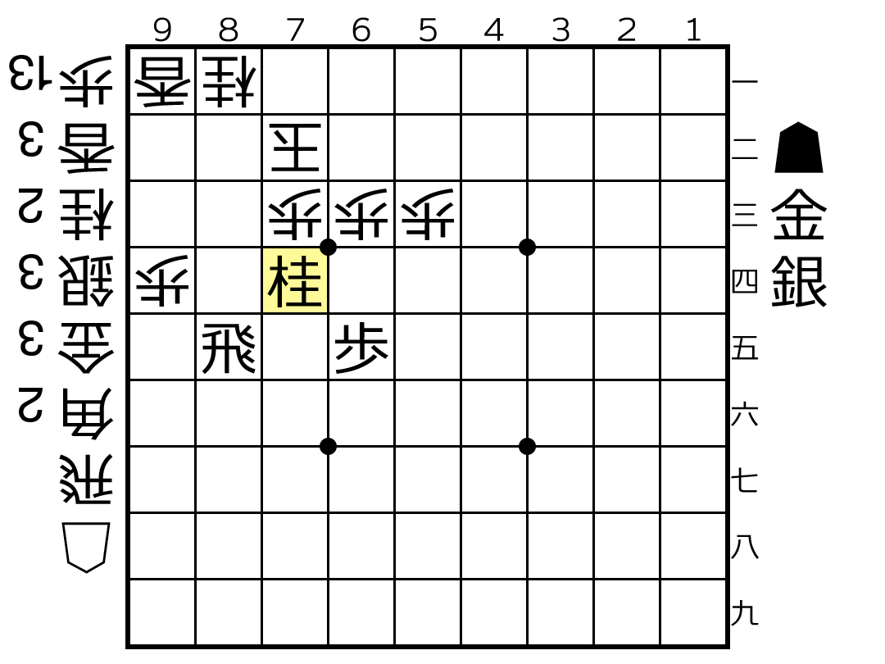
## Exercise 5
### Solution to Exercise 5

☗桂'74 ☖歩x ☗飛x81+ ☖玉x ☗銀'83.
 

Then reached the same situation as in Exercise 3.1.

<!-- 
I assume several people could conceive of the 飛 sacrifice from the context so far. But immediate ☗飛x81+ ☖玉x ☗銀'83 doesn't work because the square 73 is occupied.

The correct first move is the 桂 sacrifice. Taking the knight is forced because any other reply, for example ☖銀'71, results in checkmate: ☗金'62 ☖銀x ☗飛-82+ and so on. So ☖歩x ☗飛x桂+ ☖玉x ☗銀'83, then reached brinkmate.
 -->

---
## Exercise 6 :blue_book:
Black to move. Brinkmate in several moves.

| 6.1 | 6.2 | 6.3 |
| :-------------------------------------------------: | :-------------------------------------------------: | :-------------------------------------------------: |
|                      |                      |                      |

<!-- 
Next, I quote several problems from the book introduced earlier. Similar to Exercise 5, let's solve these problems with a focus on guiding towards the basic brinkmate position.
3, 2.. Now move on to the answer.
-->
---
## Exercise 6 :blue_book:
### Solution to Exercise 6.1
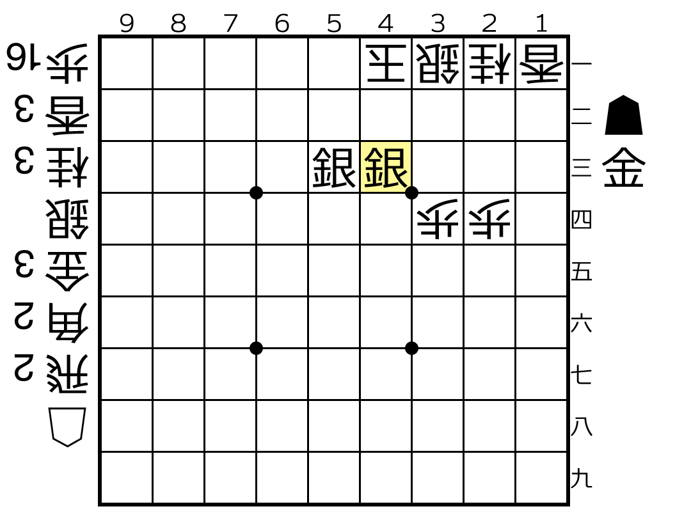

☗馬-41 ☖玉x ☗銀'43.

---
## Exercise 6 :blue_book:
### Solution to Exercise 6.2
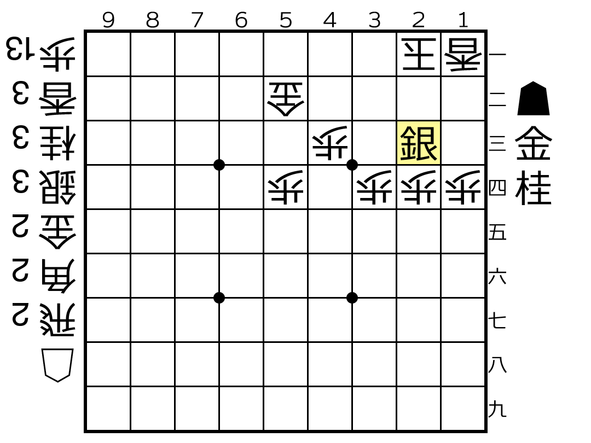

☗桂'24 ☖歩x ☗馬x22 ☖玉x ☗飛x21+ ☖玉x ☗銀'23.
 

---
## Exercise 6 :blue_book:
### Solution to Exercise 6.3
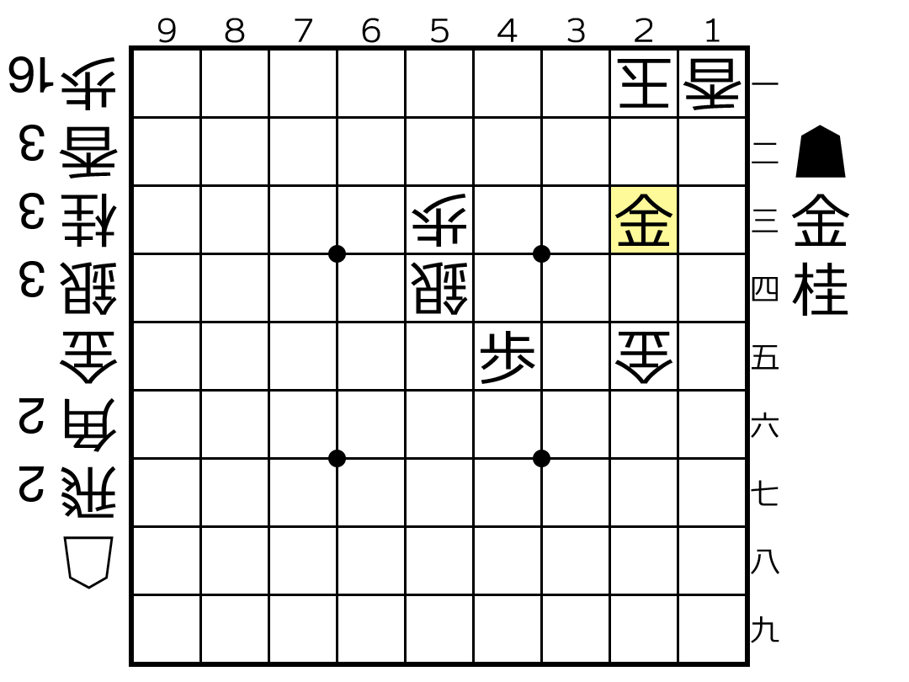

☗金'34 ☖玉-22 ☗歩-23+ ☖金x ☗飛x21+ ☖玉x ☗金x23.

<!-- 
This sacrifice may be overlooked.
 -->
---
<!-- _class: small -->

## Variation of Exercise 6.3
As for Exercise 6.3, I tried to replace 金 in hand with 飛 and found it interesting position.

## Exercise 7 :blue_book:
Black to move.
Calculate whether or not Black can reach brinkmate.

<!--
Now, let's think about the position in Exercise 6.3 where replaced the 金 in hand with a 飛. It was just a whim of mine, but upon reflection, the position reveals its depth.
Calculate whether or not Black can reach brinkmate.
This is the today's last exercise and highly challenging one.
3,2.. OK? Now move on to next page.
 -->
---
<!-- _class: small -->
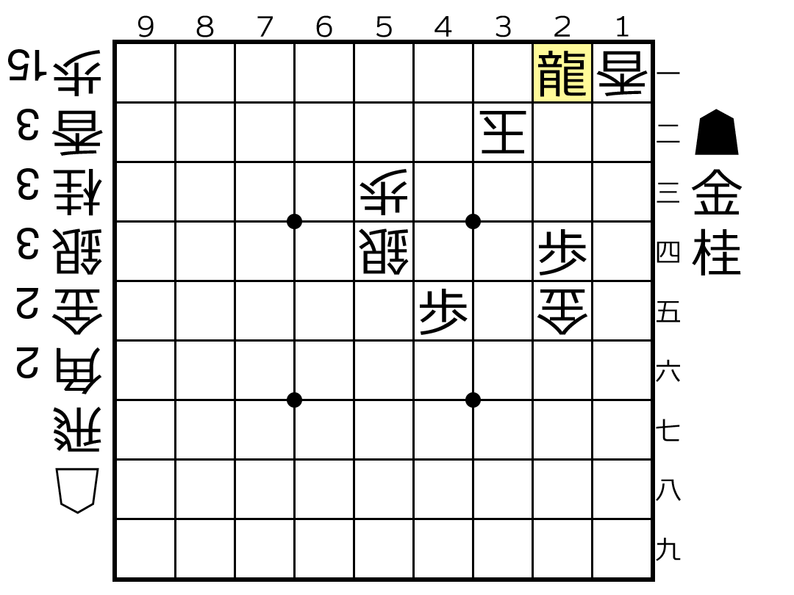
### Solution to Exercise 7

No other way at the beginning:

☗飛'34 ☖玉-22 ☗飛x32+ ☖玉x ☗飛x21+

 

Since White can't accept this sac, the following 3 options remain.

A. ☖玉-42
B. ☖玉-43
C. ☖玉-33

#### Exercise (Optional)
Which move is better?
Or does it lead to the same?

<!-- 
Attempting to brinkmate, there is no other room for the first moves.
...
As you can see, capturing this 龍 leads to brinkmate. White's king has no choice but to flee. Although there are 3 options, if you were playing as White, which one would you choose?
If you haven't thought about this position yet, please pause the video again and come to a conclusion. OK?
3,2.. let's move on.
 -->

---
<!-- _class: small -->
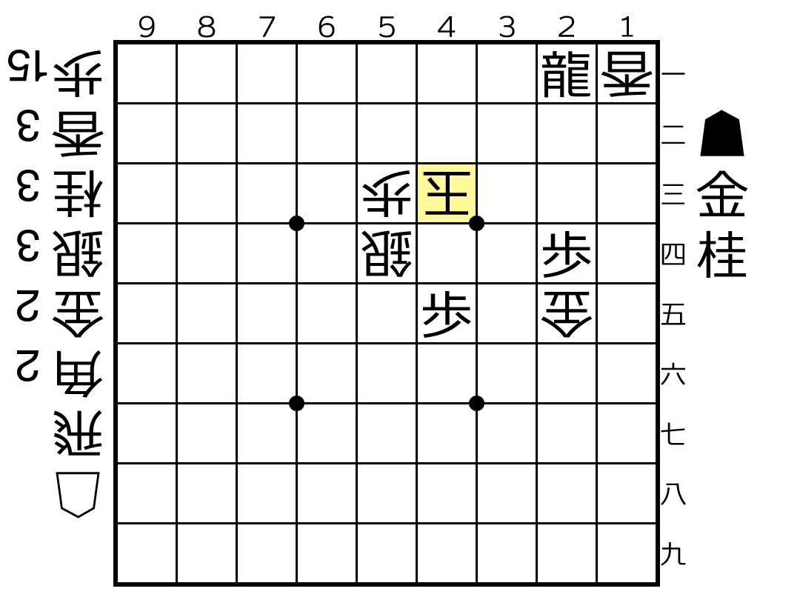
### Solution to Exercise 7
#### B. ☖玉-43?
leads to immediate checkmate:

☗龍-41 ☖玉-33 ☗金'23 ☖玉-34 ☗龍-44#.
 

<!--
The worst among the three options is ☖玉-43. This move results in an immediate checkmate.
...
 -->

---
<!-- _class: small -->
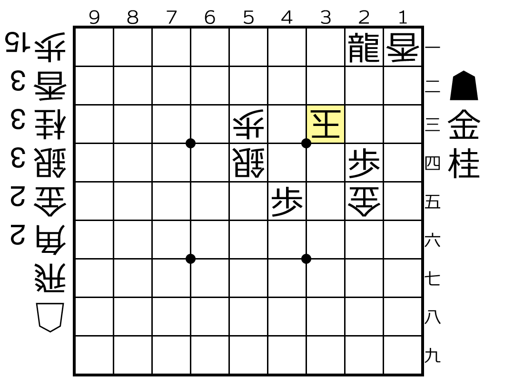
### Solution to Exercise 7
#### C. ☖玉-33!
is trying to flee through 34-35.
Many continuations are considered, e.g.

☗龍-23 ☖玉-42 ☗桂'44 ☖金'33! ☗龍-22 ☖玉-43 ☗歩-23+ ☖銀x45  ☗とx33 ☖玉-54...

or

☗金'44 ☖玉-42 ☗龍-61 ☖金'51! ☗桂'34 ☖玉-41 ☗金x53 ☖玉-32 ☗龍x51 ☖玉-33...
 

However, none of them seem to work eventually.

<!-- 
The variation of ☖玉-33 is complicated. The king is trying to flee through 34, 35. Black has to block it.
One imaginable line is ... 
Another one is ...
By reaching this position, it becomes clear that Black can't achieve brinkmate.

Many other strategies for Black can be considered, and each attack can be sustained for quite some time. However, I have concluded that with White's precise defences, there is no brinkmate.
 -->
---
<!-- _class: small -->
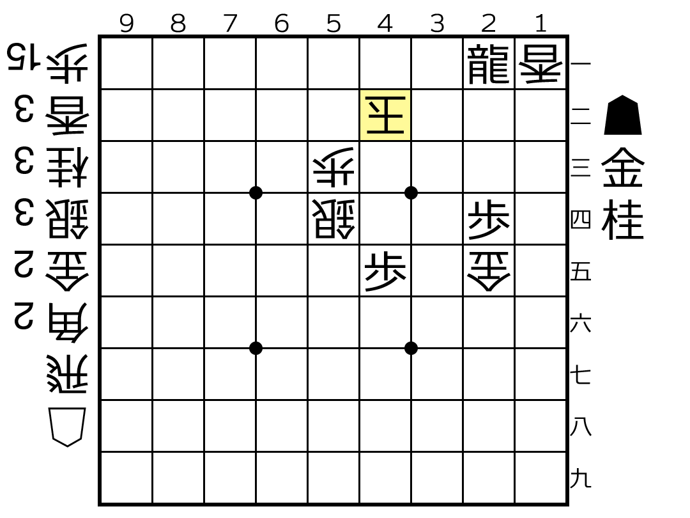
### Solution to Exercise 7
#### A. ☖玉-42!
is also resilient. For example,

☗桂'44 ☖金'41! ☗龍x ☖玉-33 ☗金'36 ☖金x ☗金'25 ☖角'43...

or

☗歩-23+ ☖飛'39 ☗龍-22 ☖歩'32! ☗とx ☖玉-52 ☗金'73 ☖玉-43! ☗龍x25 ☖飛x32+...

###
In my conclusion, Black can't achieve brinkmate when White defends precisely.

<!-- 
☖玉-42 is also playable.
One imaginable line is ...

This variation is also intricate, but my conclusion is that it cannot result in brinkmate.
 -->
---
<!-- _class: standout -->
# More Practically

<!-- 
Finally, I will introduce two more practical situations.
 -->
---

<!-- _class: small -->
## Is Your 玉 Safe?

I crafted this position, but similar ones often appear in games between top players,
e.g. ☗Sasaki, D.(7dan) - ☖Habu, Y.(9dan) on 2023-09-15.

###
Let's look at the following variation in which they attacked aggressively each other.

(☗歩'24) ☖歩x ☗飛x ☖歩'86 ☗歩x ☖飛x ☗角x22+ ☖銀x ☗角'77 ☖飛x89+? ☗角x22+

<!-- 
I came up with this position. And similar positions can be found in games between top players.
Depending on the variation, the basic brinkmate position will be potentially involved. Let's reveal that.
...
This is actually a mistake; ☖歩'23 is better.
...
 -->

---
<!-- _class: small -->
## Is Your 玉 Safe?

If White plays ☖桂'86?,

(*) ☗馬x32 ☖玉x ☗飛x21+ ☖玉x ☗銀'23. (brinkmate)
 

Alternatively if White plays ☖桂-65, Black can't choose (*) because

☖龍x78! ☗銀x ☖桂x57+! ...#
 

Therefore Black should reply
☗桂-45 or ☗馬x21, resulting in an advantageous endgame for Black.

<!-- 
Then we reached this position.
If White plays ☖桂'86, (*) leads white to brinkmate and Black king is safe.
However, when ☖桂-65 is played here alternatively, choosing this brinkmating line is blunder because ... leads black king to checkmate.
So Black has to play ☗桂-45 or ☗馬x21 for example.
As we have seen, your king can be possibly in danger in the process of brinkmate due to the resources given to the opponent. So concrete calculation becomes necessary.
 -->
---
<!-- _class: small -->
## Pieces in the Opponent's Hand

In the preceding problems, we have supposed that the opponent has all the off-board pieces in hand.

In actual games, this is not the case. Brinkmate situations often arise due to insufficient resources in hand.

### Example
If White has 銀 or 角, ☖玉 survives.

Otherwise, it is brinkmate.

<!-- 
Another thing you need to think of in a game is whether or not sufficient resources for defense are in the opponent's hand.
Let us think about this example.
If White has a 銀 or 角 and can play ☖銀'22 or ☖角'22, then White can at least prolong. Otherwise, the situation is brinkmate.

OK. This completes step 3.
 -->

---
<!-- _class: standout -->
# Summary

<!-- 
Let's wrap up with the today's main points.
 -->
---

## Summary

- Learn basic brinkmate positions.
- Calculate checkmates for each of the opponent's replies.
- Add 1 or more pieces on the board and analyze.  
  - That may provide the opponent with means of prolonging,
  - but you may still reach brinkmate with optimal attack.

- Think about chances to lead to brinkmate during your games.

<!-- 
In step 1, we learned a basic brinkmate position and confirmed the position is actually brinkmate.
In step 2, we added some pieces on the board and analyzed. In many cases, it was possible to achieve brinkmate eventually, even in response to White's attempts to prolong the game. This demonstrates the broad applicability of the basic position learned in Step 1.
In step 3, I mentioned some important conditions in actual games. With these in mind, I recommend you to attempt to lead to brinkmate during your own game.

This concludes "Brinkmate Part 1."
 -->

 ---
 <!-- _class: standout -->
# Ending

---
## Assignment

This is the the basic position of "**Brinkmate Part 2**."

- Check the position is brinkmate.
- Compare with Exercise 2 in this part.

<!-- 
Here is the preview of the position for Part 2. I wish you make sure that it is brinkmate by the next session.
 -->

<!-- By the way, I can't say when I will complete the material for the next video.
This year, I left my previous job, moved to my hometown, and decided to make this video, and now, about 6 months later, I have completed it.
I plan next time within several months, but it may take longer depending on my job starting next year.
Anyway I will do my best, so I would appreciate it if you could be patient. Bye-bye! -->